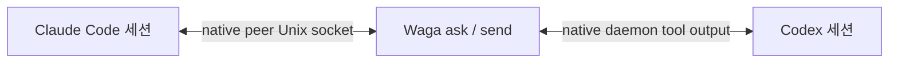

# Wattari Gattari

> Claude Code와 Codex의 네이티브 세션을 잇는 얇은 메시지 브리지입니다.

[](https://github.com/dkwlsdl3/wattari-gattari/actions/workflows/ci.yml)
[](LICENSE)

[English](README.md) · [아키텍처](docs/adr/0004-tmux-native-session-dock.md) · [라이선스](LICENSE)

Wattari Gattari(`waga`)는 Claude Code와 Codex가 각자의 세션, 터미널 UI, 도구,
승인 체계와 업데이트를 그대로 소유하면서 서로를 찾고 메시지를 주고받게 합니다.

Waga 전용 daemon도, 네이티브 대화를 대체하는 채팅 UI도 없습니다. Waga는 작은 통합
session dock만 제공하고, 세션을 열면 terminal을 각 provider의 네이티브 TUI에 넘깁니다.

## 제공 기능

- 두 제공자의 살아 있는 네이티브 세션 발견
- bare `waga` 통합 dock에서 정확한 네이티브 세션으로 바로 진입
- `waga send`로 단방향 메시지 전송
- `waga ask`로 정확히 한 번 질문하고 답변 한 건 수신
- `waga open`으로 각 제공자의 기본 Agents UI 실행
- peer 입력을 불신 입력으로 표시하고 권한이나 승인을 부여하지 않음



## 요구 사항

- Linux(현재 Claude peer 전송은 Unix socket 사용)
- Node.js 22 이상
- `agents`, `app-server daemon`을 지원하는 Codex CLI
- `agents`, cross-session messaging을 지원하는 Claude Code
- 대화형 dock에 사용할 tmux(`waga list`에는 필요 없음)

이번 실제 호환성 검증은 Codex CLI 0.152.1과 Claude Code 2.1.259에서 수행했습니다.
제공자를 업데이트한 뒤에는 `waga doctor`를 실행해 주십시오.

## 설치

```bash
git clone git@github.com:dkwlsdl3/wattari-gattari.git
cd wattari-gattari
npm install
npm link
waga doctor
```

`npm link`는 로컬 `waga` 명령을 설치합니다. 이 프로젝트는 npm에 배포하지 않습니다.

## 사용법

```bash
waga                            # Claude + Codex 통합 dock
waga list --provider claude
waga list --cwd ~/work/my-app --json

waga ask claude:<session-id> "현재 API 계약을 검토해 주세요"
waga ask codex:<thread-id> "테스트를 막는 원인이 무엇인가요?" --timeout 60
waga send codex:<thread-id> "마이그레이션 계획이 바뀌었으니 ADR을 확인해 주세요"

waga open claude
waga open codex --cwd ~/work/my-app
waga doctor
```

`waga agents`는 `waga list`의 별칭입니다. 제공자 접두사가 붙은 ID가 가장 안전하며,
유일하게 일치하는 네이티브 ID나 세션 이름도 사용할 수 있습니다.

dock에서는 `↑`/`↓`로 세션을 고르고 `Enter`로 네이티브 TUI를 엽니다. `/`는 검색,
`Tab`은 provider 필터, `q`는 이전 화면 복귀입니다. 네이티브 TUI에서는 사용하는 tmux
prefix 뒤 `0`을 눌러 dock으로 돌아옵니다. Waga 격리 tmux에서는 `Alt+G`도 동작합니다.

tmux 밖에서 시작하면 Waga 전용 격리 server를 사용합니다. 이미 tmux 안이라면 현재
server에 Waga session을 만들고 전환하므로 tmux 안에 tmux를 중첩하지 않습니다. Waga는
mouse mode를 강제하지 않아 기존 tmux와 terminal의 드래그 선택 정책을 존중합니다.
WezTerm 전용 구현도 아닙니다.

네이티브 세션 안에서는 각 제공자의 일반 셸 도구나 셸 모드로 같은 명령을 실행합니다.
Waga가 별도 슬래시 명령이나 시스템 프롬프트를 주입하지는 않습니다.

## 신뢰와 전달 규칙

모든 메시지는 사용자가 아니라 다른 세션에서 왔다고 표시됩니다. 파일 수정, 설정 변경,
자격 증명 사용, 외부 시스템 조작에 대한 권한이나 승인이 될 수 없습니다. 수신 에이전트는
기존 네이티브 sandbox와 승인 정책 안에서 행동 여부를 결정합니다.

`waga ask`는 실제 대상 transcript에 peer turn 한 건을 기록하고 답변 한 건을 기다립니다.
shadow 대화를 만들지 않으며 답변을 자동으로 다시 전달하지도 않습니다.

Claude가 사용자 확인 없이 답하려면 대상 세션이 inbound 메시지를 허용해야 합니다.

```bash
claude agents --settings '{"crossSessionInbound":"accept"}'
```

`hold`에서는 Claude가 메시지를 사용자 검토 대상으로 보류하고 모델에 전달하지 않습니다.
현재 Claude 버전은 이 보류 상태를 Waga에 돌려주지 않을 수 있어 `waga ask`가 `TIMEOUT`으로
끝날 수 있지만, 보류 메시지는 Claude 기본 UI에 표시됩니다.

Codex에는 기존 네이티브 daemon의 App Server tool-output turn으로 전달합니다. Waga는
짧게 유지되는 자신의 연결에 들어온 승인 요청을 거절하며, 네이티브 daemon을 중지하거나
교체하지 않습니다.

## 데모

`npm run demo`는 모델을 호출하지 않고 가짜 로컬 provider로 브리지 계약을 실행합니다.
[VHS](https://github.com/charmbracelet/vhs) tape도 포함되어 있으므로 VHS 설치 후
`npm run demo:record`로 녹화할 수 있습니다.

## 개발

```bash
npm test
npm run test:coverage
npm run check
npm pack --dry-run
npm run demo
```

네이티브 브리지, terminal dock과 검증 계약은
[ADR 0003](docs/adr/0003-native-session-bridge.md),
[ADR 0004](docs/adr/0004-tmux-native-session-dock.md),
[루프 엔지니어링 프로토콜](docs/adr/2026-09-02-loop-engineering-protocol.md)에 있습니다.

## 라이선스

[MIT](LICENSE)
