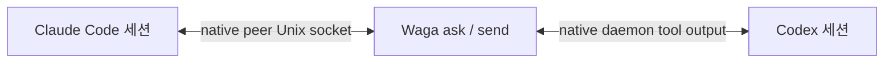

# Wattari Gattari

> Claude Code와 Codex의 네이티브 세션을 잇는 얇은 메시지 브리지입니다.

[](https://github.com/dkwlsdl3/wattari-gattari/actions/workflows/ci.yml)
[](LICENSE)

[English](README.md) · [아키텍처](docs/adr/0005-optional-session-dock-backends.md) · [라이선스](LICENSE)

Wattari Gattari(`waga`)는 Claude Code와 Codex가 각자의 세션, 터미널 UI, 도구,
승인 체계와 업데이트를 그대로 소유하면서 서로를 찾고 메시지를 주고받게 합니다.

Waga 전용 daemon도, 네이티브 대화를 대체하는 채팅 UI도 없습니다. Waga는 작은 통합
session dock만 제공하고, 세션을 열면 terminal을 각 provider의 네이티브 TUI에 넘깁니다.


## 제공 기능

- 두 제공자의 살아 있는 네이티브 세션 발견
- bare `waga` 전역 통합 dock에서 정확한 네이티브 세션으로 바로 진입
- dock에서 대화 로그를 지우지 않고 활성 세션 보관
- `waga send`로 단방향 메시지 전송
- `waga ask`로 정확히 한 번 질문하고 답변 한 건 수신
- `waga open`으로 각 제공자의 기본 Agents UI 실행
- peer 입력을 불신 입력으로 표시하고 권한이나 승인을 부여하지 않음



## 요구 사항

- Linux(현재 Claude peer 전송은 Unix socket 사용)
- Node.js 22 이상
- `agents`, `app-server daemon`을 지원하는 Codex CLI
- `agents`, cross-session messaging을 지원하는 Claude Code
- 여러 terminal에서 화면을 공유할 때 선택적으로 사용할 tmux

이번 실제 호환성 검증은 Codex CLI 0.152.1과 Claude Code 2.1.259에서 수행했습니다.
제공자를 업데이트한 뒤에는 `waga doctor`를 실행해 주십시오.

## 설치

```bash
git clone git@github.com:dkwlsdl3/wattari-gattari.git
cd wattari-gattari
npm install
npm link
waga doctor
```

`npm link`는 로컬 `waga` 명령을 설치합니다. 이 프로젝트는 npm에 배포하지 않습니다.

## 사용법

```bash
waga                            # 모든 프로젝트의 Claude + Codex 통합 dock
waga --cwd ~/work/my-app        # 한 프로젝트로 제한한 dock
waga --backend direct           # tmux 없이 실행
waga --backend tmux             # 화면 공유 backend를 필수로 사용
waga list --provider claude
waga list --cwd ~/work/my-app --json

waga ask claude:<session-id> "현재 API 계약을 검토해 주세요"
waga ask codex:<thread-id> "테스트를 막는 원인이 무엇인가요?" --wait-timeout 600 --reply-timeout 120
waga send codex:<thread-id> "마이그레이션 계획이 바뀌었으니 ADR을 확인해 주세요"

waga open claude
waga open codex --cwd ~/work/my-app
waga doctor
```

`waga agents`는 `waga list`의 별칭입니다. 제공자 접두사가 붙은 ID가 가장 안전하며,
유일하게 일치하는 네이티브 ID나 세션 이름도 사용할 수 있습니다.

dock은 세션을 접고 펼칠 수 있는 프로젝트 트리로 묶습니다. `↑`/`↓`로 이동하고,
세션에서 `Shift+↑`/`Shift+↓`를 누르면 수동 표시 순서를 바꿔 이후 새로고침과
재실행에도 유지합니다.
프로젝트에서는 `←`/`→` 또는 `Enter`로 접고 펼치며, 세션에서는 `Enter`로 네이티브
TUI를 엽니다. `/`는 검색, `Tab`은 전체 → Claude → Codex 필터 순환입니다. `Ctrl+N`은
선택한 프로젝트에서 새 세션 입력창을 열고, 입력창의 `Tab`으로 Claude/Codex를 고른 뒤
`Enter`로 정식 background session을 생성합니다. `Ctrl+R`은 새로고침, `Alt+Q`는 Waga
종료입니다. 세션에서 `Alt+X`를 두 번 누르면 활성 목록에서 보관합니다. 첫 입력은
provider별 부작용을 안내하고 두 번째 입력만 실행합니다. Codex는 대화 JSONL을
`archived_sessions`로 옮기며, Claude는 transcript를 남기고 background job과 관리
worktree를 정리합니다. 기존 `Ctrl+Q`와 `Ctrl+C`도 동작합니다. 기본 `auto` backend는
tmux가 있으면 사용하고, 실행 파일이 없으면 `direct` mode로 전환합니다.

`waga`를 실행한 폴더는 활성 세션이 하나도 없어도 트리 맨 앞에 표시됩니다. 다른 폴더에서
전역 dock을 다시 열면 overview만 새 실행 폴더 기준으로 갱신하며, 이미 열린 네이티브 세션
window와 provider 작업은 그대로 유지합니다.

tmux backend의 네이티브 TUI에서는 prefix 뒤 `0`으로 dock에 돌아옵니다. Waga 격리
server에서는 `Alt+G`도 동작하고, dock에서 `Alt+Q`로 Waga를 종료합니다. 세션 행을 다시
열면 기존 tmux window를 해당 Claude `attach` 또는 Codex `resume` 명령으로 재접속하므로
provider의 Agents View가 아니라 선택한 세션 TUI가 열립니다. direct mode에서는 Claude의
`Ctrl+Z`, Codex의 `Ctrl+D`로 native view를 빠져나오면 같은 overview로 복귀하며 provider
session은 계속 실행됩니다.

bare `waga`는 모든 프로젝트에서 살아 있는 세션을 찾습니다. `--cwd PATH`를 명시한 경우에만
해당 프로젝트로 제한합니다. tmux backend는 하나의 전역 session과 네이티브 세션별
window 하나를 재사용하므로 여러 terminal client가 붙어도 같은 작업 화면을 공유합니다.
Codex는 현재 Codex Agents가 소유한 최상위 세션만 표시합니다. 일반 CLI/VSCode 대화
기록은 목록에 섞지 않습니다. Claude는 활성 `claude agents --json` 목록만 사용하며,
Claude가 만든 worktree는 각 세션의 실제 작업 디렉터리를 유지한 채 상위 프로젝트
트리 아래에 묶습니다.

tmux 밖에서 시작하면 Waga 전용 격리 server를 사용합니다. 이미 tmux 안이라면 현재
server에 Waga session을 만들고 전환하므로 tmux 안에 tmux를 중첩하지 않습니다. 네이티브
TUI에서 휠은 provider가 mouse를 처리하면 그대로 전달하고, 그렇지 않으면 tmux
scrollback으로 동작합니다. mouse mode는 Waga session에만 적용하며 같은 server의 다른
session이나 사용자 전역 설정은 바꾸지 않습니다. terminal의 원래 드래그 선택은
`Shift`를 누른 채 사용할 수 있습니다. WezTerm 전용 구현도 아닙니다.
direct mode는 terminal view를 공유하거나 보존하지 않습니다. 현재 terminal을 네이티브
TUI에 넘긴 뒤 detach 또는 종료되면 overview를 복원하는 역할만 합니다.

설치된 Waga 소스가 바뀌면 다음 `waga` 실행이 오래된 overview window만 자동으로
재시작합니다. 기존 네이티브 session window와 provider가 소유한 실제 세션은 유지됩니다.

네이티브 세션 안에서는 각 제공자의 일반 셸 도구나 셸 모드로 같은 명령을 실행합니다.
Waga가 별도 슬래시 명령이나 시스템 프롬프트를 주입하지는 않습니다.

## 신뢰와 전달 규칙

모든 메시지는 사용자가 아니라 다른 세션에서 왔다고 표시됩니다. 파일 수정, 설정 변경,
자격 증명 사용, 외부 시스템 조작에 대한 권한이나 승인이 될 수 없습니다. 수신 에이전트는
기존 네이티브 sandbox와 승인 정책 안에서 행동 여부를 결정합니다.

`waga send`는 단방향 알림입니다. 성공 결과는 제출을 확인할 뿐, 수신 모델의 작업 완료를
뜻하지 않습니다. Claude에서는 임시 송신 endpoint를 닫기 전에 즉시 돌아온 hold나
refuse 상태도 확인합니다.

`waga ask`는 작업 중인 대상이 유휴 상태가 될 때까지 기다린 뒤 실제 대상 transcript에
peer turn 한 건을 기록하고, 그 시점부터 답변 한 건을 기다립니다. 기본 유휴 대기는 30분,
제출 후 답변 대기는 3분입니다. `--wait-timeout`과 `--reply-timeout`으로 각각 바꿀 수 있고,
기존 `--timeout`은 두 값을 함께 설정합니다. `waiting`, `submitted`, `replied` 상태는
stderr에만 출력하므로 stdout에는 답변이나 JSON 결과만 남습니다. shadow 대화를 만들지
않으며 답변을 자동으로 다시 전달하지도 않습니다.

Claude가 사용자 확인 없이 답하려면 대상 세션이 inbound 메시지를 허용해야 합니다.

```bash
claude agents --settings '{"crossSessionInbound":"accept"}'
```

`hold`에서는 Claude가 메시지를 사용자 검토 대상으로 보류하고 모델에 전달하지 않습니다.
Claude가 네이티브 disposition frame을 반환하면 Waga는 `MESSAGE_HELD` 또는
`MESSAGE_REFUSED`를 보고합니다. 해당 frame이 오지 않고 답변도 없으면
`REPLY_TIMEOUT`으로 끝나며 메시지는 Claude 기본 UI에 남습니다.

Codex에는 기존 네이티브 daemon의 App Server tool-output turn으로 전달합니다. Waga는
짧게 유지되는 자신의 연결에 들어온 승인 요청을 거절하며, 네이티브 daemon을 중지하거나
교체하지 않습니다.

## 데모

`npm run demo`는 모델을 호출하지 않고 가짜 로컬 provider로 브리지 계약을 실행합니다.
`npm run demo:dock`은 실제 provider나 사용자 세션 없이 가짜 세션으로 대화형 dock을
엽니다. [VHS](https://github.com/charmbracelet/vhs) tape는 이 안전한 dock 데모를 조작해
`docs/assets/wattari-gattari-demo.gif`를 만듭니다. VHS, `ttyd`, `ffmpeg`와
`Noto Sans Mono CJK KR` 폰트를 설치한 뒤 `npm run demo:record`를 실행하십시오. tape가
동작을 선언하므로 같은 데모를 반복해서 생성할 수 있습니다.

## 개발

```bash
npm test
npm run test:coverage
npm run check
npm pack --dry-run
npm run demo
npm run demo:dock
npm run demo:record
```

네이티브 브리지, terminal dock과 검증 계약은
[ADR 0003](docs/adr/0003-native-session-bridge.md),
[ADR 0004](docs/adr/0004-tmux-native-session-dock.md),
[ADR 0005](docs/adr/0005-optional-session-dock-backends.md),
[루프 엔지니어링 프로토콜](docs/adr/2026-09-02-loop-engineering-protocol.md)에 있습니다.

## 라이선스

[MIT](LICENSE)
