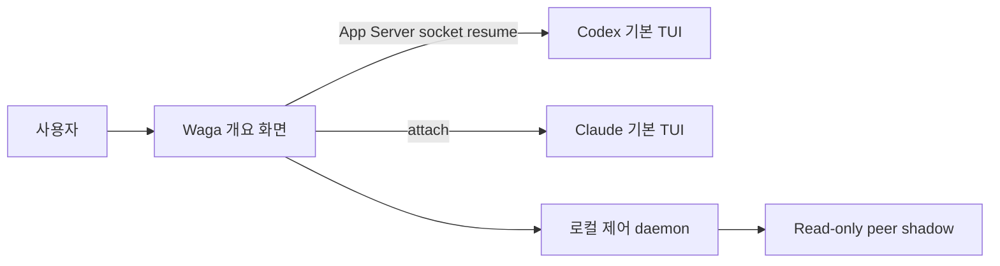

# Wattari Gattari

> Codex와 Claude Code의 기본 TUI를 오가는 가벼운 터미널 전환판입니다.

[English](README.md) · [아키텍처 결정](docs/adr/0002-native-provider-tui-wrapper.md) · [라이선스](LICENSE)

Wattari Gattari는 프로젝트별 세션을 한 화면에 모아 보여준 뒤 자리를 비켜줍니다.
세션을 선택하면 실제 입력창, 슬래시 명령, 승인, diff, 상태선, 스크롤과 키 입력을
그대로 제공하는 원본 Codex 또는 Claude Code TUI로 들어갑니다.

새로운 에이전트 채팅 클라이언트가 아니라 의도적으로 얇게 만든 wrapper입니다.

## 왜 만들었나요?

Codex와 Claude Code에는 이미 완성도 높은 터미널 UI가 있습니다. 이를 다시 만들면
제공자 업데이트를 계속 따라가야 하고 터미널 입력·스크롤 버그도 함께 떠안게 됩니다.
Wattari Gattari는 두 제공자 사이에서 공통으로 필요한 작은 계층만 유지합니다.

- 여러 프로젝트와 제공자의 세션을 한 화면에서 확인
- 기존 세션의 원본 TUI로 빠르게 전환
- 이름, 순서, 완료 표시와 명시적 종료 관리
- `waga ask`를 통한 일회성 read-only peer 질문
- 화면을 닫았다 다시 붙을 수 있는 로컬 제어 서비스

## 동작 구조



원본 TUI가 활성화된 동안 Waga는 자체 raw input 처리를 멈추고, 원본 TUI가 끝나면
목록을 새로 읽어 개요 화면을 복구합니다. 터미널 마우스 추적을 켜지 않으므로
드래그 선택과 scrollback은 WezTerm 등 터미널이 원래 하던 방식 그대로 동작합니다.

## 요구 사항

- Linux 또는 macOS 터미널
- Node.js 22 이상
- App Server와 `--remote`를 지원하는 Codex CLI
- `agents`와 `attach`를 지원하는 Claude Code CLI

현재 호환성 점검에 사용한 실제 버전은 Codex CLI 0.152.1과 Claude Code 2.1.258입니다.

## 설치

```bash
git clone git@github.com:dkwlsdl3/wattari-gattari.git
cd wattari-gattari
npm install
npm link
waga doctor
```

## 사용법

```bash
waga                         # 현재 디렉터리를 등록하고 개요 화면 열기
waga --cwd ~/work/my-app     # 지정한 프로젝트에서 열기
waga agents                  # peer 질문에 사용할 수 있는 세션 목록
waga ask <session> <task>    # read-only shadow 질문 1회
waga doctor                  # 로컬 CLI와 런타임 호환성 점검
waga stop                    # Waga 제어 서비스 종료
```

개요 화면 키:

| 키 | 동작 |
|---|---|
| `↑` / `↓` | 선택 이동 |
| `Enter` / `→` | 프로젝트 펼치기 또는 선택한 기본 TUI 열기 |
| `N` | 기본 TUI에서 새 세션 생성/열기 |
| `Tab` | 새 세션 제공자 전환 |
| `F2` | Waga에 표시할 세션 이름 변경 |
| `F3` | 완료 표시 또는 다시 열기 |
| `Shift+↑` / `Shift+↓` | 세션 순서 변경 |
| `Ctrl+X` | 확인 후 선택 세션 또는 프로젝트 세션 종료 |
| `Ctrl+C` | 개요 화면만 분리 |
| `Ctrl+Q` | 확인 후 Waga 서비스 종료 |

세션 안에서는 각 제공자의 기존 키와 슬래시 명령을 그대로 사용합니다. Waga가 이를
흉내 내거나 별도 명령 목록을 관리하지 않습니다.

## 기본 TUI 연결 계약

- 기존 Codex 세션:
  `codex --remote unix://<waga-socket> -C <workspace> resume <thread-id>`
- 새 Codex 세션: 같은 기본 TUI가 영속 thread를 직접 만들고, Waga가
  `thread/started`를 관찰해 개요에 등록합니다.
- 기존 Claude background 세션: `claude attach <short-id>`
- 새 Claude 세션: peer 통신 지침만 담은 Waga 기본 agent를 불러온
  `claude agents --cwd <workspace>`

관리 Codex 서비스는 사용자의 기존 Codex 설정을 그대로 물려받습니다. Waga가 plugin,
MCP, skill 또는 원본 승인 동작을 임의로 비활성화하지 않습니다. Peer shadow 실행은
별도 경계이며 기존처럼 ephemeral·read-only이고 외부 변경 도구를 끈 상태로 유지됩니다.

Waga가 새로 연 세션은 `waga agents`와 `waga ask`를 자동으로 알게 됩니다.
`waga ask`는 목록만 보는 명령이 아니라 대상 세션 문맥의 격리된 shadow fork에 질문하고
답변 한 건을 현재 세션으로 돌려줍니다. 어느 세션이든 먼저 요청할 수 있으며, 대상 원본
transcript를 오염시키거나 자동으로 대화를 무한 중계하지는 않습니다.
Waga 도입 전에 이미 만들어진 Claude 세션의 기록된 시스템 프롬프트는
소급해서 바꾸지 않습니다.

## 데모

실제 개요 화면을 가짜 로컬 데이터로 실행합니다.

```bash
npm run demo:tui
```

[VHS](https://github.com/charmbracelet/vhs)로 터미널 데모를 녹화할 수 있습니다.

```bash
npm run demo:record
```

데모는 실제 모델 세션을 시작하지 않습니다.

## 개발

```bash
npm test
npm run test:coverage
npm run check
npm pack --dry-run
```

현재 구조의 계약은 [ADR 0002](docs/adr/0002-native-provider-tui-wrapper.md)에 있습니다.
예전 커스텀 대화 화면 명세는 [대체된 TUI 문서](docs/tui-v0.md)에 역사 기록으로만
남겨두었습니다.

## 현재 상태

Wattari Gattari는 초기 단계의 local-first 프로젝트입니다. 제공자 실행 명령과 제어
계층은 테스트하지만 Codex나 Claude가 CLI 계약을 변경하면 호환성도 바뀔 수 있습니다.
제공자를 업데이트한 뒤에는 `waga doctor`를 실행해 주십시오.

## 라이선스

[MIT](LICENSE)
