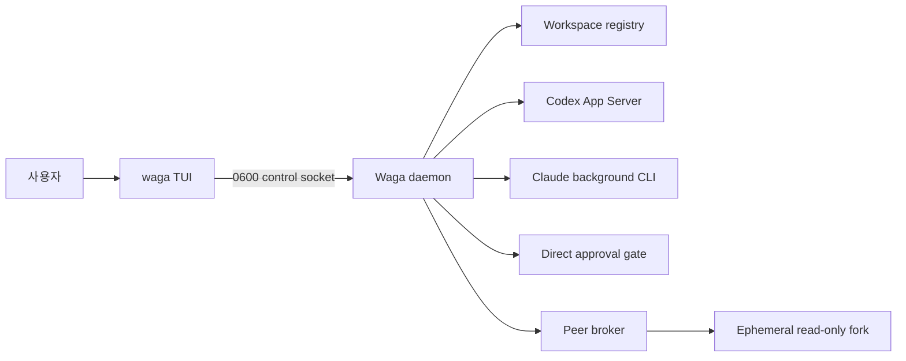

<p align="center">
  <strong>한국어</strong> · <a href="README.md">English</a>
</p>

<h1 align="center">Wattari Gattari</h1>

<p align="center">
  <strong>Codex와 Claude Code 작업 세션을 한 터미널에서 오가는 사람 중심 control plane.</strong>
</p>

<p align="center">
  <a href="#빠른-시작">빠른 시작</a> ·
  <a href="#주요-기능">주요 기능</a> ·
  <a href="#안전-모델">안전 모델</a> ·
  <a href="#개발">개발</a>
</p>

```text
 Wattari Gattari  codex + claude     global · revision 42 · direct approval
 2 projects · 1 awaiting input · 2 working · 1 completed

> ▾ sample-app  3 sessions · ~/work/sample-app
    X #130 상태 확인 중복 조사       Working          테스트 실행 중
    C #40 스냅샷 fail-closed         Awaiting input   READY
    X #126 DB 마이그레이션 검토      Completed        최종 보고 완료

  ▾ docs-site  0 sessions · ~/work/docs-site
      아직 세션이 없습니다.

  new session provider: Codex (Tab to switch)
> describe a task for a new Codex session
```

## Wattari Gattari란?

여러 프로젝트에서 실행되는 Codex와 Claude Code 세션을 프로젝트별 트리로 모아 보고,
사용자가 직접 생성·전환·응답·완료·종료하는 로컬 TUI입니다.

Wattari Gattari는 일을 스스로 배정하는 또 하나의 LLM이 아닙니다. 각 작업 세션은 서로
독립적으로 일하고, 사용자가 어떤 세션에 무엇을 맡길지 결정합니다. 이름처럼 여러 세션을
“왔다리 갔다리” 하되, 작업 수명과 중요한 승인의 주도권은 항상 사람에게 둡니다.

## 주요 기능

- **한 화면, 두 제공자** — Codex App Server thread와 Claude background session을 같은 트리에 표시합니다.
- **화면과 독립적인 작업 수명** — TUI를 닫아도 daemon이 세션과 진행 중인 턴을 유지합니다.
- **여러 프로젝트 공유** — 다른 디렉터리에서 연 TUI도 동일한 전역 상태를 즉시 받습니다.
- **대화 직접 제어** — 새 세션, 후속 메시지, 진행 중인 Codex 턴 조정, 작업 중단, 이름·순서 변경, 완료 표시, 명시적 종료를 지원합니다.
- **에이전트 작업형 대화 화면** — 하단 입력창, 작은 점으로 시작하는 에이전트 출력, 배경색을 입힌 사용자 입력, 입력창 위 실시간 작업 표시와 아래 제공자 상태선을 표시합니다.
- **어두운 터미널용 팔레트** — 폰트는 터미널 설정을 따르고 Codex·Claude·입력·상태 정보만 차분한 true color로 구분합니다.
- **bounded transcript** — 최근 100개 항목만 자동 갱신하고, `PageUp`으로 과거 기록을 명시적으로 불러옵니다.
- **직접 승인 게이트** — 중요한 Codex 작업은 현재 포그라운드 TUI의 일회성 입력으로만 승인합니다.
- **안전한 peer 질문** — 원본 대화에 메시지를 넣지 않고 격리된 read-only shadow fork에서 한 번만 질문합니다.
- **로컬 전용 상태** — socket과 카탈로그는 사용자 전용 권한으로 저장합니다.

## 작동 방식



화면은 작업 프로세스의 부모가 아니라 daemon에 재접속하는 클라이언트입니다. `Ctrl+C`는
화면만 닫고, 세션 종료와 daemon 종료는 각각 별도 확인 키를 요구합니다.

## 요구 사항

- Linux 또는 macOS 터미널
- Node.js 22 이상
- `codex` CLI
- `claude` CLI

현재 프로젝트는 로컬 사용을 위한 private npm package입니다.

## 빠른 시작

```bash
cd /path/to/wattari-gattari
npm install
npm link
```

관리할 프로젝트에서 실행합니다.

```bash
cd ~/work/sample-app
waga
```

다른 프로젝트에서도 `waga`를 열면 같은 전역 허브에 연결됩니다.

```bash
cd ~/work/docs-site
waga
```

## CLI

```bash
waga                         # 현재 디렉터리를 등록하고 TUI 열기
waga --cwd ~/work/sample-app  # 지정한 프로젝트에서 TUI 열기
waga agents                  # peer 질문이 가능한 세션 목록
waga ask <session> "검토 요청" # read-only shadow 질문 한 번
waga doctor                  # CLI·App Server·Claude JSON·daemon 계약 진단
waga stop                    # 공유 daemon 종료
waga --version
```

`waga doctor`는 버전 문자열만 확인하지 않습니다. 모델 턴을 만들지 않고 Codex App Server
초기화와 Claude `agents --json` 파싱까지 검사합니다.

## 키 조작

| 키 | 동작 |
|---|---|
| `↑` / `↓` | 프로젝트·세션 선택 또는 입력 기록 탐색 |
| `Enter` / `→` | 프로젝트 접기·펼치기 또는 세션 열기 |
| `←` | 대화에서 목록으로 돌아가기 |
| `Space` | 선택한 세션에 빠른 답장 |
| `Tab` | 새 세션 제공자를 Codex/Claude로 전환 |
| `Shift+↑` / `Shift+↓` | 공유 세션 순서 변경 |
| `F2` | 표시 이름 변경 |
| `F3` | 유휴 세션을 `Completed`로 표시하거나 다시 열기 |
| `PageUp` / `PageDown` | 긴 transcript 이동·과거 페이지 로드 |
| `Esc` | 대화 입력창이 비어 있을 때 진행 중인 턴 중단 |
| `Ctrl+X`, `Ctrl+X` | 선택 세션 또는 프로젝트의 모든 세션 종료 |
| `Ctrl+C` | TUI만 detach |
| `Ctrl+Q`, `Ctrl+Q` | 공유 daemon 종료 |

`Completed`는 provider의 단순한 턴 종료를 자동으로 오해하지 않습니다. 사용자가 최종
보고를 확인한 뒤 `F3`으로 표시하며, 새 메시지를 보내면 완료 표시가 해제됩니다.

대화 화면에서 `/`를 입력하면 현재 제공자의 기본 명령 메뉴가 열립니다. 명령명과 설명을
검색할 수 있고 `↑`/`↓`로 이동한 뒤 `Tab` 또는 `Enter`로 선택합니다. 목록의 `●`는
Wattari Gattari에서 바로 실행할 수 있다는 뜻이고, `○`는 계정·브라우저·확인 대화상자 등
원본 CLI의 대화형 화면이 필요하다는 뜻입니다.

- 공통: 상태·사용량, 중단, 이름 변경, 마지막 답변 복사, Git diff, 목록 이동과 종료
- Codex App Server: `/compact`, `/fork`, `/review`, `/model`, `/effort`, `/fast`,
  `/personality`, `/permissions`, `/mcp`, `/skills`
- Claude background: `/compact`, `/fork`, `/branch`, `/model`, `/effort`와 background에서
  실행 가능한 기본 스킬 명령(코드 리뷰·검증·단순화 등)

카탈로그는 2026-09-02 공식 문서의 Codex 기본 명령 51개와 Claude Code 기본 명령
111개를 반영합니다. 설치 버전·운영체제·요금제·feature flag에 따라 실제 원본 CLI의
목록은 달라질 수 있습니다. 카탈로그에 없는 프로젝트 스킬 같은 `/` 시작 텍스트는 일반
프롬프트로 제공자에게 그대로 전달합니다. Codex 작업 중 일반 메시지는 App Server
steering으로 현재 턴에 추가하며, Claude는 세션 복제 방지를 위해 현재 턴이 끝난 뒤
다음 메시지를 받습니다.

## 안전 모델

Codex 관리 세션은 정확한 `PreToolUse` 승인 훅과 격리 상태가 확인될 때만
`workspace-write`를 사용합니다.

- 일반 조사, workspace 수정, 빌드와 테스트는 세션 정책 안에서 진행합니다.
- 파일 삭제, Git push·강제 정리, 프로세스 중단, 배포, 권한 확대 등은 TUI에 승인 요청을 표시합니다.
- 승인은 session·turn·tool item·명령 원문이 모두 일치할 때 15초 동안 한 번만 소비됩니다.
- 화면이 없거나 요청이 달라지거나 만료되면 fail-closed로 거부합니다.
- peer RPC에는 승인 기능과 자동 relay가 없습니다.
- 외부 MCP, apps, plugins, computer use는 관리 App Server에서 비활성화합니다.
- 관리 턴의 network access는 비활성화합니다.

셸 명령 분류기는 직접 삭제, `find -delete`, 인라인 interpreter, container·cluster·배포
명령 등 알려진 위험 패턴을 차단하지만 임의 스크립트의 모든 부작용을 완전하게 판별할
수는 없습니다. 중요한 저장소에서는 Git 상태와 별도 백업을 함께 사용하십시오.

Claude가 자체 권한 입력을 기다리는 `Needs input`은 표시만 합니다. Claude의 권한 UI를
대리하지 않으며, 사용자가 `claude attach <id>`에서 직접 처리합니다.

자세한 결정은 [ADR 0001](docs/adr/0001-human-controlled-session-console.md)에 있습니다.

## 상태와 로그

| 종류 | 기본 위치 |
|---|---|
| Runtime socket / PID | `$XDG_RUNTIME_DIR/wattari-gattari` |
| 카탈로그 / 로그 | `$XDG_STATE_HOME/wattari-gattari` 또는 `~/.local/state/wattari-gattari` |

기존 `agent-bus` 카탈로그는 최초 실행 시 원본을 보존한 채 복사합니다. daemon과 Codex
App Server 로그는 각각 2MiB에서 회전하며 최근 3개를 보존합니다.

## 터미널 데모

README용 데모는 실제 사용자 세션을 녹화하기보다, 가짜 control adapter를 사용하는
격리 데모를 [VHS](https://github.com/charmbracelet/vhs) tape로 재생하는 방식을 권장합니다.
VHS는 terminal GIF 절차를 코드로 보관할 수 있어 같은 화면 크기와 키 입력을 반복해서
만들 수 있습니다. 실제 운용 과정을 가볍게 공유할 때는
[asciinema](https://github.com/asciinema/asciinema)의 `.cast` 형식도 적합합니다.

데모 자산을 추가할 때의 원칙은 다음과 같습니다.

- 10~20초 이내
- 실제 transcript·경로·세션 ID·자격증명 미포함
- fake daemon과 임시 XDG 상태만 사용
- `.tape` 원본을 GIF와 함께 버전 관리

저장소에는 실제 TUI 코드와 가짜 세션만 사용하는 데모를 포함합니다.

```bash
npm run demo:tui       # 녹화 없이 직접 확인
npm run demo:record    # VHS 설치 후 docs/assets에 GIF 생성
```

VHS가 없는 환경에서는 공식 Docker 이미지로도 같은 tape를 렌더링할 수 있습니다. 생성된
`docs/assets/wattari-gattari-demo.gif`는 내용과 크기를 검토한 뒤 README 상단에 추가합니다.

## 개발

```bash
npm test                 # 격리 테스트
npm run test:coverage    # Node 내장 커버리지
npm run check            # 구문 검사 + 테스트 + fake broker 데모
npm pack --dry-run       # 배포 파일 확인
```

CI는 Node.js 22와 24에서 `npm run check`와 패키징을 확인합니다. 실제 모델 E2E는 비용과
사용자 세션 영향을 피하기 위해 기본 검사에 포함하지 않으며, 격리된 임시 상태에서 별도
검증합니다. 실측 배경은 [조사 기록](docs/research-2026-09-01.md), 화면 계약은
[TUI v0 명세](docs/tui-v0.md)를 참고하십시오.

## 프로젝트 상태

Wattari Gattari는 초기 로컬 도구이며 interface와 provider 계약이 계속 바뀔 수 있습니다.
현재 구현은 실제 Codex·Claude 세션 수명, 직접 승인, shadow 질문까지 검증했지만 공개
패키지 호환성을 약속하는 안정 버전은 아닙니다.

## 라이선스

[MIT](LICENSE)
