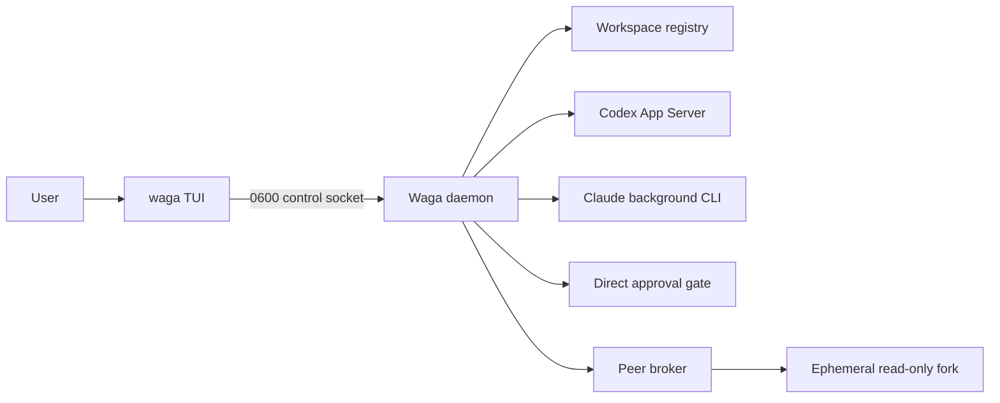

<p align="center">
  <a href="README.ko.md">한국어</a> · <strong>English</strong>
</p>

<h1 align="center">Wattari Gattari</h1>

<p align="center">
  <strong>A human-controlled terminal hub for moving between Codex and Claude Code sessions.</strong>
</p>

<p align="center">
  <a href="#quick-start">Quick start</a> ·
  <a href="#highlights">Highlights</a> ·
  <a href="#safety-model">Safety model</a> ·
  <a href="#development">Development</a>
</p>

```text
 Wattari Gattari  codex + claude     global · revision 42 · direct approval
 2 projects · 1 awaiting input · 2 working · 1 completed

> ▾ sample-app  3 sessions · ~/work/sample-app
    X #130 investigate duplicate refresh   Working          running tests
    C #40 fail-closed snapshot              Awaiting input   READY
    X #126 review DB migration              Completed        final report ready

  ▾ docs-site  0 sessions · ~/work/docs-site
      No sessions yet.

  new session provider: Codex (Tab to switch)
> describe a task for a new Codex session
```

## What is Wattari Gattari?

Wattari Gattari is a local TUI that collects Codex and Claude Code sessions from
multiple projects into one tree. The user creates, switches, replies to, completes,
and stops each session explicitly.

It is not another LLM that assigns work on its own. Every worker session remains
independent, while the user decides which session receives each task. The name
roughly means “moving back and forth”: move freely between sessions without giving
up human control over their lifetime or sensitive approvals.

## Highlights

- **Two providers, one screen** — Codex App Server threads and Claude background sessions share one tree.
- **Screen-independent lifetime** — the daemon keeps sessions and active turns alive after the TUI closes.
- **Shared across projects** — TUIs opened from different directories receive the same global state immediately.
- **Direct conversation control** — create, message, rename, reorder, complete, reopen, and explicitly stop sessions.
- **Bounded transcripts** — refresh only the latest 100 items and load older history explicitly with `PageUp`.
- **Direct approval gate** — sensitive Codex actions require a one-time decision from the foreground TUI.
- **Safe peer questions** — ask once through an isolated, read-only shadow fork without writing into the original conversation.
- **Local-only state** — sockets and catalogs use user-only filesystem permissions.

## How it works



The screen is a reconnecting client, not the parent of the worker processes.
`Ctrl+C` detaches only the screen. Stopping a session or the shared daemon requires
a separate confirmation chord.

## Requirements

- A Linux or macOS terminal
- Node.js 22 or later
- The `codex` CLI
- The `claude` CLI

The project is currently a private npm package intended for local use.

## Quick start

```bash
cd /path/to/wattari-gattari
npm install
npm link
```

Run it from a project you want to manage:

```bash
cd ~/work/sample-app
waga
```

Opening `waga` in another project connects to the same global hub:

```bash
cd ~/work/docs-site
waga
```

## CLI

```bash
waga                              # Register the current directory and open the TUI
waga --cwd ~/work/sample-app           # Open the TUI for a specific project
waga agents                       # List sessions available for peer questions
waga ask <session> "review this"  # Ask once through a read-only shadow fork
waga doctor                       # Diagnose CLI, provider, and daemon contracts
waga stop                         # Stop the shared daemon
waga --version
```

`waga doctor` checks more than version strings. Without creating a model turn, it
initializes Codex App Server and validates the output of Claude
`agents --json`.

## Key bindings

| Key | Action |
|---|---|
| `↑` / `↓` | Select a project or session, or browse input history |
| `Enter` / `→` | Collapse or expand a project, or open a session |
| `←` | Return from a conversation to the session list |
| `Space` | Quickly reply to the selected session |
| `Tab` | Switch the new-session provider between Codex and Claude |
| `Shift+↑` / `Shift+↓` | Reorder a session in shared state |
| `F2` | Rename the selected session |
| `F3` | Mark an idle session `Completed`, or reopen it |
| `PageUp` / `PageDown` | Navigate a long transcript and load older pages |
| `Ctrl+X`, `Ctrl+X` | Stop the selected session or all sessions in a project |
| `Ctrl+C` | Detach only the TUI |
| `Ctrl+Q`, `Ctrl+Q` | Stop the shared daemon |

Wattari Gattari never treats the end of a provider turn as automatic completion.
The user marks a reviewed result with `F3`; sending another message clears the
completion marker.

## Safety model

A managed Codex session receives `workspace-write` access only after Wattari
Gattari verifies the exact `PreToolUse` approval hook and isolation contract.

- Routine investigation, workspace edits, builds, and tests run within the session policy.
- File deletion, Git push or forced cleanup, process termination, deployment, and permission widening require a TUI approval.
- An approval is valid for 15 seconds and can be consumed once only when session, turn, tool item, and command text all match.
- Missing screens, mismatched requests, and expired approvals fail closed.
- Peer RPC has no approval capability and never automatically relays messages.
- External MCP servers, apps, plugins, and computer use are disabled in the managed App Server.
- Network access is disabled for managed turns.

The shell classifier covers known dangerous forms such as direct deletion,
`find -delete`, inline interpreters, containers, clusters, and deployment commands.
It cannot infer every side effect hidden inside an arbitrary script. Keep Git state
and an independent backup for important repositories.

Claude's own `Needs input` permission state is display-only. Wattari Gattari does
not impersonate Claude's permission UI; the user handles it directly with
`claude attach <id>`.

See [ADR 0001](docs/adr/0001-human-controlled-session-console.md) for the detailed
design decision.

## State and logs

| Kind | Default location |
|---|---|
| Runtime socket / PID | `$XDG_RUNTIME_DIR/wattari-gattari` |
| Catalogs / logs | `$XDG_STATE_HOME/wattari-gattari` or `~/.local/state/wattari-gattari` |

On first use, legacy `agent-bus` catalogs are copied without modifying the original.
Daemon and Codex App Server logs rotate at 2 MiB and retain the latest three backups.

## Terminal demo

For a README demo, use the isolated fake control adapter rather than recording real
user sessions. The included [VHS](https://github.com/charmbracelet/vhs) tape keeps
terminal dimensions and keystrokes reproducible. For lightweight recordings of a
real operational session, [asciinema](https://github.com/asciinema/asciinema)'s
`.cast` format is also a good fit.

Demo asset rules:

- Keep it between 10 and 20 seconds.
- Never include real transcripts, paths, session IDs, or credentials.
- Use only the fake daemon and temporary XDG state.
- Version the `.tape` source alongside the generated GIF.

The repository includes a demo that runs the real TUI against fake sessions only:

```bash
npm run demo:tui       # Inspect the demo without recording
npm run demo:record    # Generate the GIF in docs/assets after installing VHS
```

The official VHS Docker image can render the same tape without a local installation.
Review the content and size of `docs/assets/wattari-gattari-demo.gif` before adding
it near the top of this README.

## Development

```bash
npm test                 # Isolated test suite
npm run test:coverage    # Built-in Node.js coverage
npm run check            # Syntax checks, tests, and fake broker demo
npm pack --dry-run       # Inspect package contents
```

CI runs `npm run check` and package validation on Node.js 22 and 24. Real-model E2E
tests are kept out of the default suite to avoid cost and changes to user sessions;
run them separately with isolated temporary state. See the
[research notes](docs/research-2026-09-01.md) for measured background and the
[TUI v0 specification](docs/tui-v0.md) for the screen contract.

## Project status

Wattari Gattari is an early local tool. Its interfaces and provider contracts may
still change. The current implementation has exercised real Codex and Claude session
lifetime, direct approvals, and shadow questions, but it does not yet promise stable
public-package compatibility.

## License

[MIT](LICENSE)
