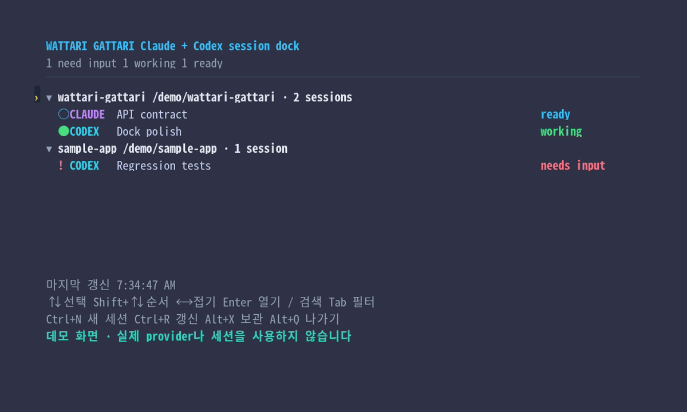
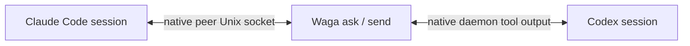

# Wattari Gattari

> A thin message bridge between native Claude Code and Codex sessions.

[](https://github.com/dkwlsdl3/wattari-gattari/actions/workflows/ci.yml)
[](LICENSE)

[한국어](README.ko.md) · [Architecture](docs/adr/0005-optional-session-dock-backends.md) · [License](LICENSE)

Wattari Gattari (`waga`) lets Claude Code and Codex sessions find and message
each other while both providers keep ownership of their sessions, terminal UI,
tools, approvals, and updates.

There is no Waga daemon and no replacement chat UI. Waga adds a small session
dock, then hands the terminal to each provider's native TUI.



## What it does

- discovers live native sessions from both providers;
- opens one global dock with bare `waga` and jumps directly into an exact native session;
- archives active sessions from the dock without deleting their conversation logs;
- sends a one-way peer message with `waga send`;
- asks for exactly one reply with `waga ask`;
- opens either provider's native Agents UI with `waga open`;
- labels peer input as untrusted and never grants permissions or approvals.



## Requirements

- Linux (Claude peer transport currently uses Unix sockets)
- Node.js 22+
- Codex CLI with `agents` and `app-server daemon`
- Claude Code with `agents` and cross-session messaging
- tmux for the optional shared-window dock experience

The current live compatibility pass used Codex CLI 0.152.1 and Claude Code
2.1.259. Run `waga doctor` after provider upgrades.

## Install

```bash
git clone git@github.com:dkwlsdl3/wattari-gattari.git
cd wattari-gattari
npm install
npm link
waga doctor
```

`npm link` installs the local `waga` command. The project is not published to npm.

## Usage

```bash
waga                            # global interactive Claude + Codex dock
waga --cwd ~/work/my-app        # dock filtered to one project
waga --backend direct           # run without tmux
waga --backend tmux             # require the shared-window backend
waga list --provider claude
waga list --cwd ~/work/my-app --json

waga ask claude:<session-id> "Review the current API contract"
waga ask codex:<thread-id> "What is blocking the test?" --wait-timeout 600 --reply-timeout 120
waga send codex:<thread-id> "The migration plan changed; inspect the ADR"

waga open claude
waga open codex --cwd ~/work/my-app
waga doctor
```

`waga agents` is an alias for `waga list`. Provider-prefixed IDs are the safest
targets; an exact unique native ID or session name also works.

The dock groups sessions into collapsible project trees. Use `↑`/`↓` to move,
and `Shift+↑`/`Shift+↓` on a session to persistently reorder it across refreshes
and restarts.
`←`/`→` or `Enter` to collapse and expand a project, and `Enter` on a session to
open its native TUI. `/` searches and `Tab` cycles all → Claude → Codex. `Ctrl+N`
opens a new-session composer in the selected project; use `Tab` in the composer
to choose Claude or Codex, then `Enter` to create a real background session.
`Ctrl+R` refreshes and `Alt+Q` exits Waga. `Ctrl+Q` and `Ctrl+C` remain available
for compatibility. Press `Alt+X` twice on a session to archive it from the active
list: the first press explains the provider-specific effect and only the second
performs it. Codex moves its conversation JSONL into `archived_sessions`; Claude
keeps the transcript while removing the background job and its managed worktree.
The default `auto` backend uses tmux when available and otherwise falls back to
`direct` mode.

The directory where `waga` was launched appears first even when it has no active
sessions. Re-entering the global dock from another directory refreshes only the
overview for that launch directory; existing native windows and provider work
keep running.

With tmux, use your prefix followed by `0` to return to the dock; Waga's isolated
server also provides `Alt+G`, and `Alt+Q` exits Waga from the dock. Reopening a
session row reconnects the existing tmux window with Claude `attach` or Codex
`resume`, so it opens the selected session TUI rather than a provider Agents View.
In direct mode, detach the native view with `Ctrl+Z` in Claude or `Ctrl+D` in
Codex. The provider session keeps running.

Bare `waga` discovers live sessions across all projects. A cwd filter is applied
only when `--cwd PATH` is explicit. The tmux backend reuses one global session and
one window per native session, including when multiple terminal clients attach.
For Codex, the dock mirrors the top-level sessions currently owned by Codex
Agents. Ordinary CLI/VSCode history is not mixed into the dock. For Claude, it
uses the active `claude agents --json` list and groups Claude-managed worktrees
under their parent project while preserving each session's real working directory.

When started outside tmux, Waga uses its own isolated tmux server. When started
inside tmux, it creates a Waga session in the current server and switches to it;
it does not nest tmux. In native TUIs, the wheel is forwarded when the provider
handles mouse input and otherwise scrolls through tmux history. Mouse mode is
scoped to the Waga session and does not change another session or the user's
global tmux configuration. Hold `Shift` for the terminal's native text selection.
It does not depend on WezTerm.
Direct mode does not share or preserve terminal views; it simply lends the current
terminal to the native TUI and restores the overview after detach or exit.

When Waga's installed source changes, the next `waga` invocation automatically
restarts only a stale overview window. Existing native session windows and the
provider-owned sessions behind them remain intact.

From a native session, run the same command through that provider's normal shell
tool or shell mode. Waga does not inject custom slash commands or system prompts.

## Trust and delivery

Every message says that it came from another session, not the user. It is never
permission to edit files, change settings, use credentials, or touch external
systems. The receiving agent still decides what to do under its existing native
sandbox and approval policy.

`waga send` is a one-way notification. A successful result confirms submission,
not that the receiving model completed work. For Claude, Waga also catches an
immediate native hold or refusal before its temporary sender endpoint closes.

`waga ask` waits for a busy target to become available before it writes one peer
turn into the real target transcript, then waits for one answer. The default busy
wait is 30 minutes and the fresh reply window after submission is 3 minutes.
Override them independently with `--wait-timeout` and `--reply-timeout`; the
legacy `--timeout` option sets both. State transitions (`waiting`, `submitted`,
`replied`) go to stderr so stdout remains only the answer or JSON result. Waga
does not fork a shadow conversation and never auto-forwards an answer.

For unattended Claude replies, the target must allow inbound messages, for example:

```bash
claude agents --settings '{"crossSessionInbound":"accept"}'
```

With `hold`, Claude visibly holds the message for user review and does not run it.
When Claude returns the native disposition frame, Waga reports `MESSAGE_HELD` or
`MESSAGE_REFUSED`; if that frame is absent, an unanswered request ends as
`REPLY_TIMEOUT` and remains visible in the native Claude UI.

Codex messages use a standalone App Server tool-output turn on the existing native
daemon. Waga declines any approval request addressed to its short-lived connection
and never stops or replaces the native daemon.

## Demo

`npm run demo` exercises the bridge contract with fake local providers and no
model calls. `npm run demo:dock` opens the interactive dock with fake sessions,
without touching a real provider or user session. The included
[VHS](https://github.com/charmbracelet/vhs) tape drives that safe dock demo and
writes `docs/assets/wattari-gattari-demo.gif`. Install VHS, `ttyd`, `ffmpeg`, and
the `Noto Sans Mono CJK KR` font, then run `npm run demo:record`. Because the
interaction is declared in the tape, the same demo can be regenerated after UI
changes.

## Development

```bash
npm test
npm run test:coverage
npm run check
npm pack --dry-run
npm run demo
npm run demo:dock
npm run demo:record
```

The native bridge, terminal dock, and verification contract live in
[ADR 0003](docs/adr/0003-native-session-bridge.md),
[ADR 0004](docs/adr/0004-tmux-native-session-dock.md),
[ADR 0005](docs/adr/0005-optional-session-dock-backends.md), and
[the loop engineering protocol](docs/adr/2026-09-02-loop-engineering-protocol.md).

## License

[MIT](LICENSE)
