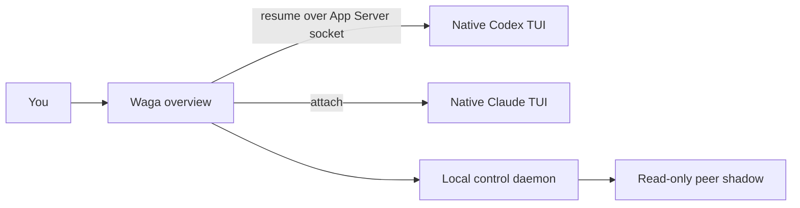

# Wattari Gattari

> A lightweight terminal switchboard for native Codex and Claude Code sessions.

[한국어](README.ko.md) · [Architecture decision](docs/adr/0002-native-provider-tui-wrapper.md) · [License](LICENSE)

Wattari Gattari gives you one project-oriented overview, then gets out of the
way. Select a session and continue in the provider's own terminal UI—with its
real composer, slash commands, approvals, diffs, status line, scrolling, and
input behavior.

It is intentionally a wrapper, not another agent chat client.

## Why

Codex and Claude Code already ship capable terminal interfaces. Reimplementing
those interfaces creates lag, terminal bugs, and a permanent compatibility
burden. Wattari Gattari keeps only the small layer that is useful across both:

- one overview for multiple workspaces and providers;
- quick handoff to an existing native session;
- session names, ordering, completion markers, and explicit stop controls;
- one-shot, read-only peer questions through `waga ask`;
- a background control service so the overview can detach and reconnect.

## How it works



Waga suspends its own raw input while a provider TUI is active and restores the
overview after that process exits. It never enables terminal mouse reporting,
so selection and scrollback remain terminal-native.

## Requirements

- Linux or macOS terminal
- Node.js 22+
- Codex CLI with App Server and `--remote` support
- Claude Code CLI with `agents` and `attach` support

The live versions used for the current compatibility pass were Codex CLI
0.152.1 and Claude Code 2.1.258.

## Install

```bash
git clone git@github.com:dkwlsdl3/wattari-gattari.git
cd wattari-gattari
npm install
npm link
waga doctor
```

## Usage

```bash
waga                         # register this directory and open the overview
waga --cwd ~/work/my-app     # open from another workspace
waga agents                  # list sessions visible to peer questions
waga ask <session> <task>    # one read-only shadow question
waga doctor                  # check local CLI/runtime compatibility
waga stop                    # stop the Waga control service
```

Overview keys:

| Key | Action |
|---|---|
| `↑` / `↓` | Move selection |
| `Enter` / `→` | Expand a workspace or open the selected native TUI |
| `N` | Create/open a native session |
| `Tab` | Switch the new-session provider |
| `F2` | Rename Waga session metadata |
| `F3` | Mark complete/reopen |
| `Shift+↑` / `Shift+↓` | Reorder a session |
| `Ctrl+X` | Stop the selected session or workspace sessions, after confirmation |
| `Ctrl+C` | Detach the overview |
| `Ctrl+Q` | Stop the Waga service, after confirmation |

Inside a session, use the provider's normal keys and slash commands. Waga does
not emulate them.

## Native handoff contract

- Existing Codex session:
  `codex --remote unix://<waga-socket> -C <workspace> resume <thread-id>`
- New Codex session: the same native TUI creates the persistent thread directly;
  Waga observes `thread/started` and adds it to the overview
- Existing Claude background session: `claude attach <short-id>`
- New Claude session: `claude agents --cwd <workspace>` with Waga's bundled,
  prompt-only peer-protocol agent loaded as the default

The managed Codex service inherits the user's normal Codex configuration. Waga
does not disable plugins, MCP servers, skills, or native approval behavior.
Peer-shadow execution is separate and remains ephemeral, read-only, and stripped
of external mutation surfaces.

New sessions opened by Waga learn `waga agents` and `waga ask` automatically.
`waga ask` is not just inventory: it asks an isolated shadow fork carrying the
target session's context and returns one answer to the calling session. Either
session can initiate; the request does not mutate the target transcript or start
an automatic relay.
Claude sessions that already existed before Waga keep their recorded system
prompt; Waga does not rewrite that history.

## Demo

Run the real overview against fake local data:

```bash
npm run demo:tui
```

Record the terminal demo with [VHS](https://github.com/charmbracelet/vhs):

```bash
npm run demo:record
```

The demo never starts a real model session.

## Development

```bash
npm test
npm run test:coverage
npm run check
npm pack --dry-run
```

The architecture contract lives in
[ADR 0002](docs/adr/0002-native-provider-tui-wrapper.md). The old custom
conversation-screen specification is preserved only as historical context in
[the superseded TUI note](docs/tui-v0.md).

## Status

Wattari Gattari is an early local-first project. The provider command seams and
control-plane behavior are covered by tests, but compatibility can change when
Codex or Claude change their CLI contracts. Run `waga doctor` after upgrading a
provider.

## License

[MIT](LICENSE)
