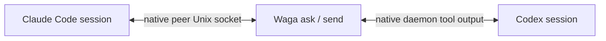

# Wattari Gattari

> A thin message bridge between native Claude Code and Codex sessions.

[](https://github.com/dkwlsdl3/wattari-gattari/actions/workflows/ci.yml)
[](LICENSE)

[한국어](README.ko.md) · [Architecture](docs/adr/0004-tmux-native-session-dock.md) · [License](LICENSE)

Wattari Gattari (`waga`) lets Claude Code and Codex sessions find and message
each other while both providers keep ownership of their sessions, terminal UI,
tools, approvals, and updates.

There is no Waga daemon and no replacement chat UI. Waga adds a small session
dock, then hands the terminal to each provider's native TUI.

## What it does

- discovers live native sessions from both providers;
- opens a unified dock with bare `waga` and jumps directly into an exact native session;
- sends a one-way peer message with `waga send`;
- asks for exactly one reply with `waga ask`;
- opens either provider's native Agents UI with `waga open`;
- labels peer input as untrusted and never grants permissions or approvals.



## Requirements

- Linux (Claude peer transport currently uses Unix sockets)
- Node.js 22+
- Codex CLI with `agents` and `app-server daemon`
- Claude Code with `agents` and cross-session messaging
- tmux for the interactive dock (`waga list` does not require it)

The current live compatibility pass used Codex CLI 0.152.1 and Claude Code
2.1.259. Run `waga doctor` after provider upgrades.

## Install

```bash
git clone git@github.com:dkwlsdl3/wattari-gattari.git
cd wattari-gattari
npm install
npm link
waga doctor
```

`npm link` installs the local `waga` command. The project is not published to npm.

## Usage

```bash
waga                            # interactive Claude + Codex dock
waga list --provider claude
waga list --cwd ~/work/my-app --json

waga ask claude:<session-id> "Review the current API contract"
waga ask codex:<thread-id> "What is blocking the test?" --timeout 60
waga send codex:<thread-id> "The migration plan changed; inspect the ADR"

waga open claude
waga open codex --cwd ~/work/my-app
waga doctor
```

`waga agents` is an alias for `waga list`. Provider-prefixed IDs are the safest
targets; an exact unique native ID or session name also works.

In the dock, use `↑`/`↓` to select a session, `Enter` to open its native TUI,
`/` to search, `Tab` to filter providers, and `q` to return. From a native TUI,
use your tmux prefix followed by `0` to return to the dock. Waga's isolated tmux
server also provides `Alt+G`.

When started outside tmux, Waga uses its own isolated tmux server. When started
inside tmux, it creates a Waga session in the current server and switches to it;
it does not nest tmux. Waga does not force mouse mode, so the current tmux and
terminal selection policy remains in control. It does not depend on WezTerm.

From a native session, run the same command through that provider's normal shell
tool or shell mode. Waga does not inject custom slash commands or system prompts.

## Trust and delivery

Every message says that it came from another session, not the user. It is never
permission to edit files, change settings, use credentials, or touch external
systems. The receiving agent still decides what to do under its existing native
sandbox and approval policy.

`waga ask` writes one peer turn into the real target transcript and waits for one
answer. It does not fork a shadow conversation and never auto-forwards an answer.

For unattended Claude replies, the target must allow inbound messages, for example:

```bash
claude agents --settings '{"crossSessionInbound":"accept"}'
```

With `hold`, Claude visibly holds the message for user review and does not run it.
Current Claude builds may not return that hold status to Waga, so `waga ask` can
end as `TIMEOUT`; the held message remains visible in the native Claude UI.

Codex messages use a standalone App Server tool-output turn on the existing native
daemon. Waga declines any approval request addressed to its short-lived connection
and never stops or replaces the native daemon.

## Demo

`npm run demo` exercises the bridge contract with fake local providers and no
model calls. A [VHS](https://github.com/charmbracelet/vhs) tape is included; after
installing VHS, record it with `npm run demo:record`.

## Development

```bash
npm test
npm run test:coverage
npm run check
npm pack --dry-run
npm run demo
```

The native bridge, terminal dock, and verification contract live in
[ADR 0003](docs/adr/0003-native-session-bridge.md),
[ADR 0004](docs/adr/0004-tmux-native-session-dock.md), and
[the loop engineering protocol](docs/adr/2026-09-02-loop-engineering-protocol.md).

## License

[MIT](LICENSE)
