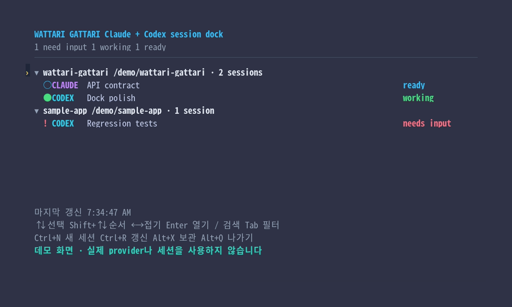

# Wattari Gattari

[](https://github.com/dkwlsdl3/wattari-gattari/actions/workflows/ci.yml)
[](LICENSE)

[한국어](README.ko.md) · [Architecture](docs/adr/README.md) · [License](LICENSE)

Wattari Gattari (`waga`) opens and connects live Claude Code and Codex sessions
from one local dock, without another daemon or replacement chat UI.



## Features

- Browse sessions by project and open their native TUIs
- Search, filter, reorder, rename, create, and archive
- View Claude and Codex quota with a five-minute cache
- Preview the selected session's latest input and response on wide terminals
- Send notifications with `waga send` or request replies with `waga ask`

## Requirements and install

- Linux and Node.js 22+
- Codex CLI and Claude Code with Agents support
- Optional: tmux for reusable and shared terminal views

Run `waga doctor` to check the connection environment after provider upgrades.

```bash
git clone git@github.com:dkwlsdl3/wattari-gattari.git
cd wattari-gattari
npm install
npm link
waga doctor
```

The project is not published to npm.

## Quick start

```bash
waga                            # global session dock
waga --cwd ~/work/my-app        # limit the dock to one project
waga --backend direct           # run without tmux
waga --backend tmux             # require the tmux backend
waga list --provider claude
waga list --json

waga send codex:<thread-id> "Inspect the ADR"
waga ask claude:<session-id> "Review the current API contract"
waga ask codex:<thread-id> "Run the full verification" --until-idle
waga open codex --cwd ~/work/my-app
```

`waga agents` aliases `waga list`. Provider-prefixed targets such as
`claude:<id>` and `codex:<id>` are recommended.

## Dock keys

At 120 columns × 20 rows or larger, the right pane shows recent conversation text.
Only the selected session is read, with a 150 ms selection debounce and five-second
cache; hidden docks do not poll. Long histories are bounded excerpts, not a live
terminal mirror. The latest response may belong to an earlier prompt. No model
calls or additional transcript files are created.

| Key | Action |
|---|---|
| `↑` / `↓` | Move |
| `Shift+↑` / `Shift+↓` | Reorder sessions |
| `←` / `→` / `Enter` | Collapse or expand a project |
| `Enter` on a session | Return to its running native TUI |
| `Alt+Enter` on a session | Force a native TUI reattach |
| `/` / `Tab` | Search / filter providers |
| `F2` | Rename the selected session |
| `Alt+N` / `Alt+R` | New session / refresh |
| `Alt+X` twice | Archive a session |
| `Alt+Q` | Exit Waga |

The default `auto` backend reuses tmux session windows when available, otherwise
it uses `direct`. To leave a native view:

- Waga's isolated tmux: `Alt+G` for the dock; `Alt+A` for a separate provider Agents View
- Inside existing tmux: prefix then `0` for the dock
- Direct: Claude `Ctrl+Z` or Codex `Ctrl+D` to exit/detach the native view

After internal navigation with Claude's `←` or Codex's `/agents`, selecting a
session in the dock returns to that session. See the [ADR](docs/adr/README.md)
for view-reuse rules.

- **Rename:** immediate for Codex; applied once on the next prompt for hook-enabled
  Claude sessions created by Waga. Without the hook, Claude uses a local alias;
  the save notice distinguishes these cases.
- **Archive:** logs are preserved. Codex moves to archived sessions; Claude cleans
  up the background job and managed worktree.

If old output overwrites a resumed Codex 0.153.4 screen, `/raw on` provides a
workaround with simpler formatting and unchanged logs. A new TUI may need it again;
Waga does not change other sessions' display modes or global settings.

## Peer messages

- `send`: one-way notification; confirms submission only.
- `ask`: waits for idle, submits one turn to the real transcript, and returns the first reply.
- `ask --until-idle`: Codex confirms the submitted turn's completion and returns its
  last answer. Claude checks idle after the peer reply, without native-turn correlation
  or a guarantee that this is the final answer.

Peer messages are untrusted input, not user instructions or approvals; native
sandbox and approval rules remain in force. There is no automatic relay. Sessions
created with `Alt+N` receive usage and trust-boundary guidance through provider
instructions, separate from the user's first prompt.

For unattended Claude replies, allow inbound messages in the target session:

```bash
claude agents --settings '{"crossSessionInbound":"accept"}'
```

## Demo and development

```bash
npm run demo          # exercise messaging with fake providers
npm run demo:dock     # open the dock with fake sessions
npm run demo:record   # regenerate the GIF with VHS
npm run check
npm run benchmark     # in-memory processing and frame strings; excludes provider I/O and terminal drawing
npm pack --dry-run
```

GIF generation requires [VHS](https://github.com/charmbracelet/vhs), `ttyd`,
`ffmpeg`, and the `Noto Sans Mono CJK KR` font. See the
[testing procedure](docs/testing-plan.md) for coverage boundaries and mutation tests.

Diagnostics go to `~/.local/state/wattari-gattari/events.jsonl` without conversation
content. [integrations/](integrations/) contains logrotate and systemd files for 30-day retention.

## License

[MIT](LICENSE)
